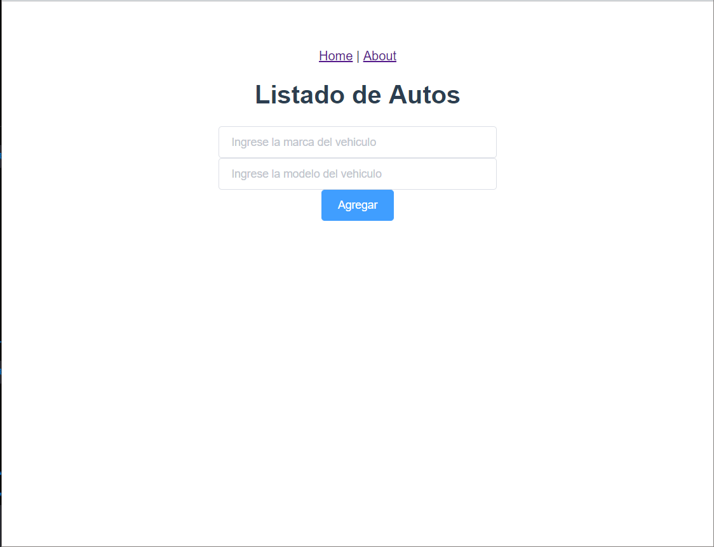
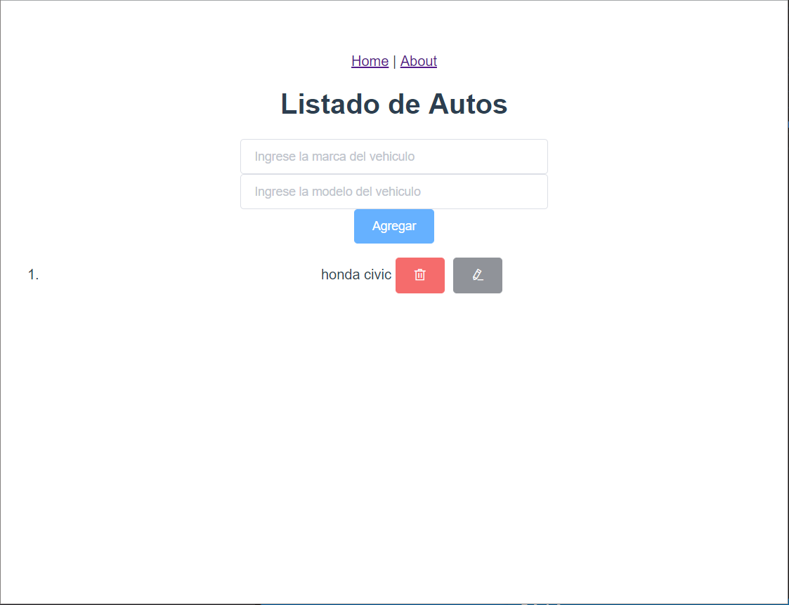
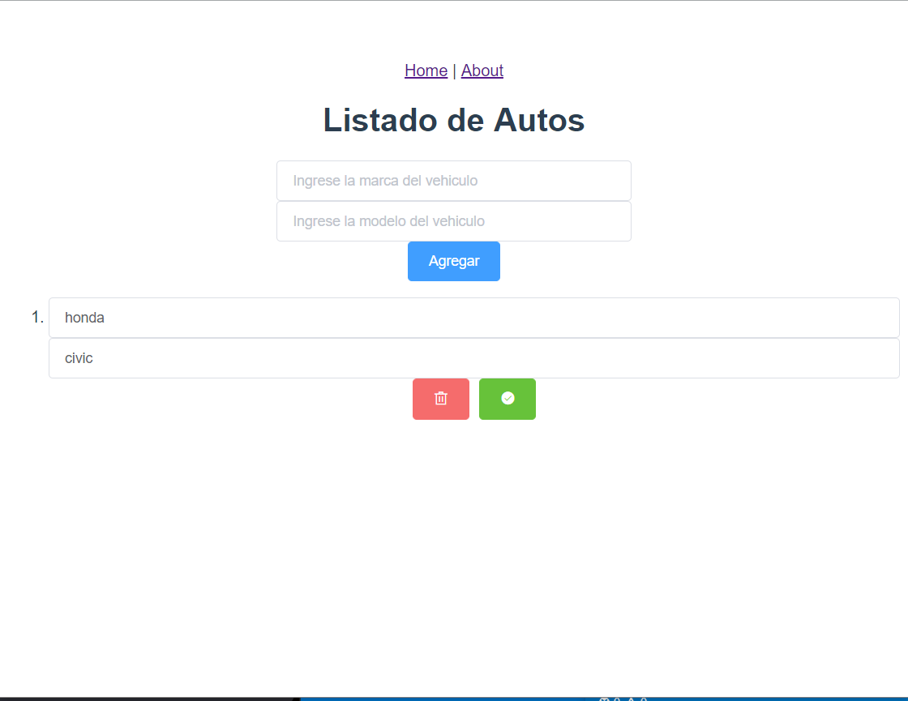

# firebase

## Project setup
```
npm install
```

### Compiles and hot-reloads for development
```
npm run serve
```

### Compiles and minifies for production
```
npm run build
```

### Run your tests
```
npm run test
```

### Lints and fixes files
```
npm run lint
```
# Taller #5

⦁	Utilizando el framework de Vue.js se creó una página web la cual usando Firebase para almacenar los datos de un vehículo tomando en cuenta las marca y modelo.




⦁	Agregamos los datos de marca y modelo en sus respectivos campos y damos clic en el botón de agregar para poder hacer la inserción de datos en la base de datos.




⦁	Una vez guardo el registro se muestran los iconos de borrar o editar los registros que se vayan creando. 




⦁	Por último, en la vista principal (Home, la cual contiene el formulario), se muestra un link hace la vista de About, donde al presionar sobre ella se configuro una router-vue que muestra la información de los integrantes del grupo.


integrantes:

Carlos Canto 8-896-2125

Daniel Rodas E-8-138555

Ricardo Velasco 1-741-1919


